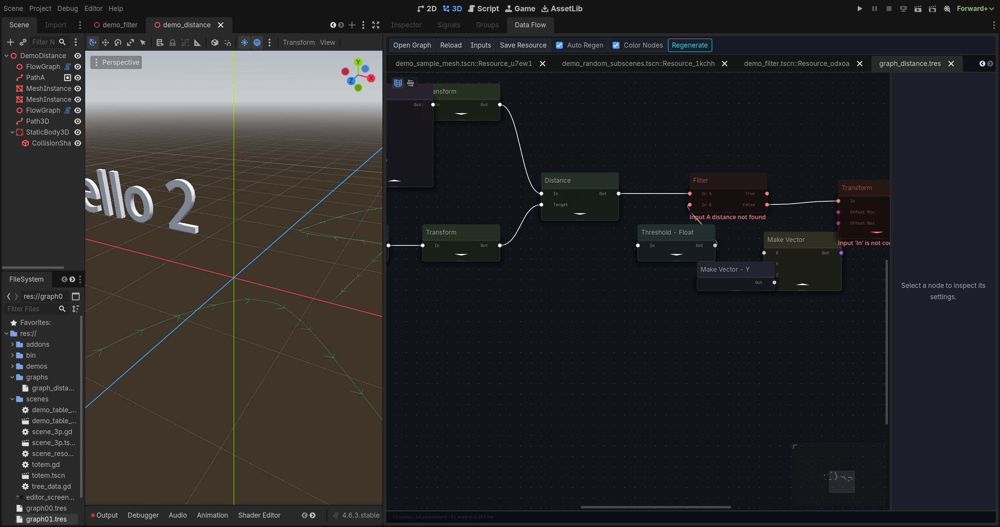
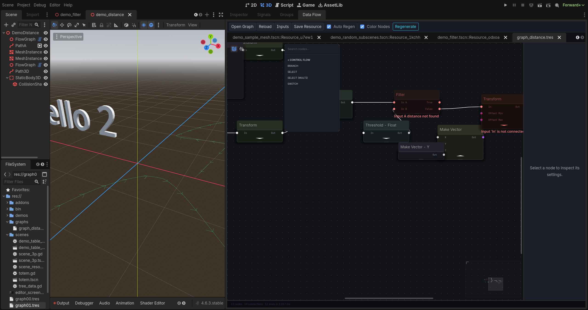
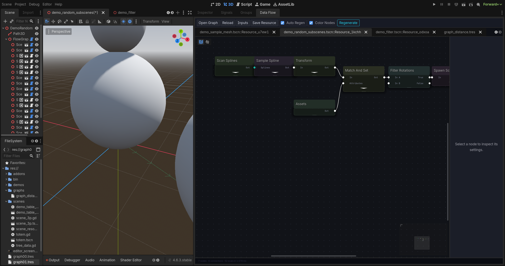

# PCGODOT (Flow Graph)

[](https://godotengine.org)
[](#)

**PCGODOT** is a highly powerful, node-based Procedural Content Generation (PCG) framework for Godot 4.6, heavily inspired by **Unreal Engine 5's PCG**. It enables developers to construct intricate point-set distributions, manipulate spatial attributes, and spawn meshes or scenes procedurally using a visual flow graph.

This version has been upgraded to align **1:1 with Unreal Engine's PCG Node Reference**, featuring improved control flow, advanced filtering, and a polished dark HSL theme.

---

## 🎨 Gallery & Showcases

### The Modern Graph Editor UI
Enjoy a highly polished, responsive visual editing experience with custom-themed HSL-colored nodes, grid shader backdrops, smooth connection rendering, and dynamic inspector sidebars.



### 1:1 Unreal Engine Category Organization
The Search-and-Add node menu has been restructured into standardized, clean categories matching Unreal PCG.

| Main Categories Menu | Control Flow Submenu |
| --- | --- |
|  |  |

### Procedural Forest and Object Distribution
Distribute subscenes randomly along curves and paths using attributes, custom rotation-alignment filters, and scene scanners.

| The Flow Graph | Evaluated 3D Result |
| --- | --- |
|  |  |

---

## 🚀 Key Features

* **Unreal Engine PCG Alignment (1:1)**: Unified categories, names, and logic schemas conforming to the Unreal PCG specifications.
* **+50 Nodes**: A robust suite of nodes covering:
  * Spline & Mesh sampling (surface, volume, interior).
  * Math operations, custom expressions, and reductions.
  * Tagging, attribute manipulation, and boolean data filters.
  * Raycasting, collision setup, and spatial queries.
* **Advanced Subgraphs & Loops**: Seamlessly nest graphs inside other graphs with local parameters, custom outputs, and array loops.
* **Core Tagging Support**: A dedicated `tags` property (`PackedStringArray`) inside data elements for advanced tag-based filtering.
* **Live 3D Debug Overlay**: Direct 3D viewport visualizations showing point positions, density gradients, scale, and rotations.
* **Grid Data Inspector**: Step-by-step table viewing of attributes at any node in the graph, with active highlighting in the 3D viewport.
* **Copy/Paste**: Import/export graph components instantly as JSON.

---

## 📂 Node Library Categories

PCGODOT organizes nodes according to the official Unreal Engine PCG structure:

### 🧩 Subgraphs & Control Flow
* **Subgraph**: Runs another PCG graph resource inline.
* **Loop**: Evaluates a subgraph repeatedly over elements.
* **Output**: Exposes custom output ports for subgraphs.
* **Branch**: Directs point-sets down different paths based on conditions.
* **Select**: Routes a single dataset dynamically.
* **Select Multi**: Merges and routes multiple datasets.
* **Switch**: Evaluates multiple pathways using integer keys.

### 📊 Filtering & Sampling
* **Filter Data by Tag**: Isolates points based on their string tags.
* **Filter Data by Attribute**: Evaluates comparisons (e.g. `density > 0.5`) to isolate points.
* **Filter Data by Type**: Filters data points by spatial class type.
* **Select Points**: Samples points based on ratios or thresholds.
* **Sample Mesh**: Distributes points across a 3D Mesh's faces.
* **Sample Spline**: Follows or fills 3D curves.

### 📐 Point Ops & Densities
* **Bounds Modifier**: Shrinks, expands, or aligns point bounds.
* **Build Rotation from Up**: Generates correct rotations matching custom surface normals.
* **Combine Points**: Combines spatial properties of multiple points.
* **Duplicate Point**: Multiplies points with custom offsets.
* **Density Remap**: Modulates point density values using curve remapping.
* **Distance to Density**: Scales point density based on proximity to other objects.

---

## 🛠️ Installation & Setup

1. Copy the following folders from this repository into your Godot project's root:
   * `demo/addons/flow_nodes_editor`
   * `demo/bin`
2. Open your project in Godot: **Project** → **Project Settings** → **Plugins**.
3. Locate **Flow Nodes Editor** and toggle the status to **Enabled**.

---

## 🎮 Quickstart Guide

In a 3D Scene:
1. Create a `FlowGraphNode3D` node.
2. In the right-hand panel, select the **Data Flow** dock (appears when the node is selected).
3. Press **Shift+A** (or **Right-click**) inside the graph to open the **Add Node** panel.
4. Add a generator like **Grid**, then connect it to **Spawn Scenes** or **Spawn Meshes**.
5. Press **D** on a selected node to toggle its 3D debug visualizer.
6. Press **E** to toggle the bottom **Data Inspector** and view the raw attributes of each point.

---

## 🏗️ Building from Sources

If you want to compile the KdTree and RTree C++ wrappers yourself:

```bash
git submodule update --init
scons
```
Precompiled binaries for Windows and macOS are included under `demo/bin/` by default.

---

## 📄 License
This project is licensed under the MIT License. Feel free to adapt and expand it!
